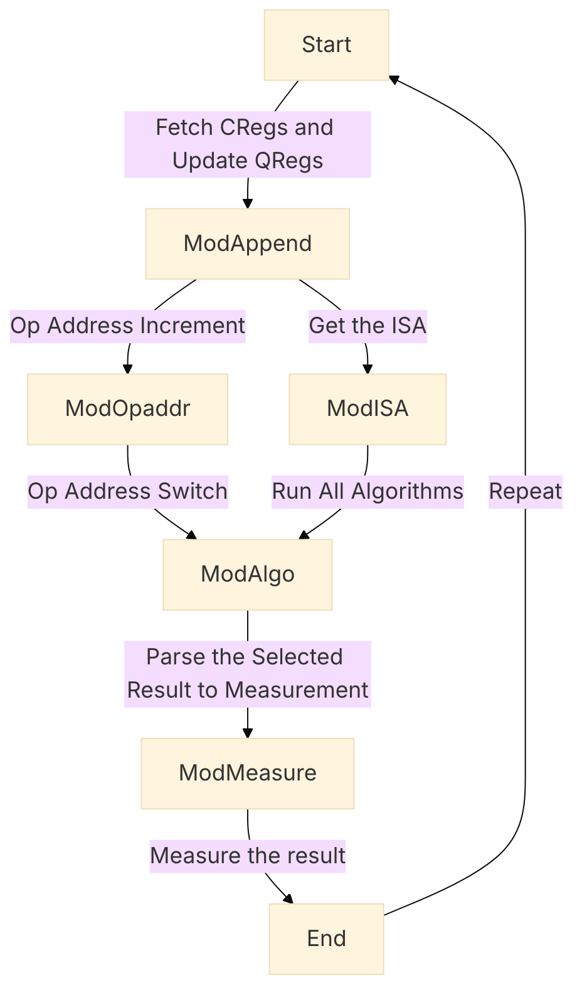
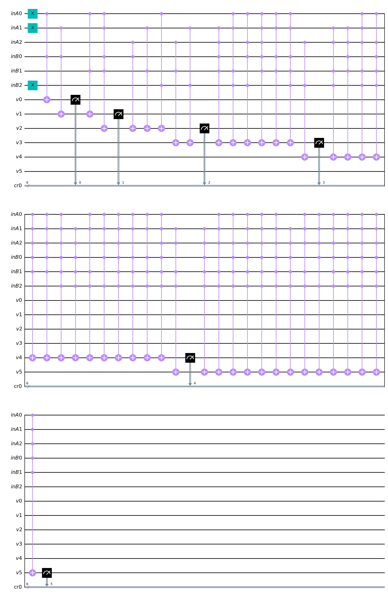

# GISC
## Grid Instruction Set Computer

## Description
GISC is an instruction set architecture designed for the ***general-purpose quantum computer***. Here is the proof of conept with a 8 bits GISC qpu.  

\*For the proof of conept with a classical computer. Please go to ...  

## Design
<_Image_>

## Simulation
The project is simulated in python3 with Qiskit. Please install the required libraries and repositories before proceeding.

### Requirements
python3: https://www.python.org  
Qiskit: https://qiskit.org  
pip:  https://pip.pypa.io  

### Usage
```
user@computer: python3 arch.py
```

## ISA
***Opcode***  
- ***Set***: Assign value to a register
- ***Cpy***: Copy from one grid register to another
- ***Phy***: Copy from one phys register to grid register
- ***Fly***: Jump to another instruction if the jump condition is true

\* ISA refers to Instruction Set Architecture
\* Grid Registers connect to Grid Registers, Phys Registers and physical layer output  
\* Phys Registers connect to Grid Registers and physical layer input  


| ISA | Dec | Bin | Architecture | Usage | Example(Dec) |Example(Bin)
| :--:|:-:| :-: | :----: | :---- |:-: |:-:|
| Set |1| 01 | <_Set_> <_GRegA_>  <_Value_> | Assign 3 to GReg 1 |1 1 3| 01 001 011 |
| Cpy |2| 10 | <_Cpy_> <_GRegA_>  <_GRegB_> | Copy 3 from GReg 1 to GReg 2 |2 2 1| 10 010 001 |
| Phy |3| 11 | <_Phy_> <_GRegA_>  <_PRegB_> | Copy 3 from PReg 4 to GReg 1 |3 1 4| 11 001 100 |
| Fly |0| 00 | <_Fly_> <_DCare_>  <_DCare_> | Jump to another instruction |0 0 0| 00 000 000 |

\* GReg: Grid Register  
\* PReg: Phys Register  
\* DCare: Don't Care  
\* Dec: Decimal  
\* Bin: Binary  


## Architecture


\* ModAppend: Module Append  
\* ModOpaddr: Module Operation Address  
\* ModISA: Module ISA  
\* ModAlgo: Module Algorithm  
\* ModMeasure: Module Measurement  

------------------------------------------------------------
## Key Components

### Qfe (Quantum Flip Engine)
<_Image of Qfe_>  
<_Code of Qfe_>  


### Arithmetic

#### Flip

#### Mask

#### Shift
<_Image of Shift_>  
<_Code of Shift_>  

#### Equal

#### Greater

#### Addition 

#### Multiplication (e.g 3bits 3*4)
<p align="left">
  
</p>

## 8-bits GISC Quantum Computer Prototype
Codename: Darklain

## Specification
Length of ISA: 8 Bits  
Number of loops: 10 runs  
Number of Quantum bits: 177  
Number of Classical bits: 42  
Depth of Logic Gates: 151  
Depth of Basis Gates: 8058  

## Key Parameters
|Name|Binary|Decimal|
|:-|-:|:-:|
|OP_SET 		| 01|1|
|OP_CPY 		| 10|2|
|OP_PHY 		| 11|3|
|OP_FLY 		| 00|0|
|QUB_REGA 		|000|0|
|QUB_REGB 		|001|1|
|QUB_SG   		|010|2|
|QUB_INPUTA 	|011|3|
|QUB_INPUTB 	|100|4|
|QUB_F_CON 		|011|3|
|QUB_F_POS 		|100|4|
|QUB_INPUTS 	|101|5|
|QUB_OUTPUTCL	|110|6|
|QUB_OUTPUTCU	|111|7|
|VAL_ZERO 		|000|0|
|VAL_ONE 		|001|1|
|VAL_TWO   		|010|2|
|VAL_THREE 		|011|3|
|VAL_FOUR 		|100|4|
|VAL_FIVE 		|101|5|
|VAL_SIX		|110|6|
|VAL_SEVEN		|111|7|

## Sample Input
Purpose:  
**To test registers assignment, copying and loop.**
```
SET QUB_INPUTA VAL_TWO  
SET QUB_INPUTB VAL_THREE  
CPY QUB_INPUTS QUB_OUTPUTCL  
SET QUB_F_CON VAL_ONE  
SET QUB_F_POS VAL_SEVEN  
FLY  
FLY  
```
Explain:    
\* Set grid register qub_inputA to 2  
\* Set grid register qub_inputB to 3  
\* Copy grid register qub_inputB from grid register qub_outputcl  
\* Set jump condition to 1  
\* Set jump instruction to 7  
\* Fly  

## Sample Output

```
start
----------------------------
run  1
Current Addr:  0
ISA: OP_SET QUB_INPUTA VAL_TWO 

Result: {'000001001011010000000000000010000000000001': 1}
opaddr  1 | 0 0 1
isa  0 1 0 1 1 0 1 0
fly,set,cpy,phy  0 1 0 0
regA  0
regB  0
regSG  0
regInputA  2
regInputB  0
regInputS  0
regOutputCL  0
regOutputCU  0
----------------------------

----------------------------
run  2
Current Addr:  1
ISA: OP_SET QUB_INPUTB VAL_THREE

Result: {'000001001100011000000000011010000000000010': 1}
opaddr  2 | 0 1 0
isa  0 1 1 0 0 0 1 1
fly,set,cpy,phy  0 1 0 0
regA  0
regB  0
regSG  0
regInputA  2
regInputB  3
regInputS  0
regOutputCL  0
regOutputCU  0
----------------------------

----------------------------
run  3
Current Addr:  2
ISA: OP_SET QUB_INPUTS VAL_SEVEN

Result: {'000001001101111000110111011010000000000011': 1}
opaddr  3 | 0 1 1
isa  0 1 1 0 1 1 1 1
fly,set,cpy,phy  0 1 0 0
regA  0
regB  0
regSG  0
regInputA  2
regInputB  3
regInputS  7
regOutputCL  6
regOutputCU  0
----------------------------

----------------------------
run  4
Current Addr:  3
ISA: OP_CPY QUB_REGA QUB_OUTPUTCL

Result: {'000010010000110000110111011010000000110100': 1}
opaddr  4 | 1 0 0
isa  1 0 0 0 0 1 1 0
fly,set,cpy,phy  0 0 1 0
regA  6
regB  0
regSG  0
regInputA  2
regInputB  3
regInputS  7
regOutputCL  6
regOutputCU  0
----------------------------

----------------------------
run  5
Current Addr:  4
ISA: OP_SET QUB_F_CON VAL_ONE

Result: {'010001001011001000011111011001000000110101': 1}
opaddr  5 | 1 0 1
isa  0 1 0 1 1 0 0 1
fly,set,cpy,phy  0 1 0 0
regA  6
regB  0
regSG  0
regInputA  1
regInputB  3
regInputS  7
regOutputCL  3
regOutputCU  0
----------------------------

----------------------------
run  6
Current Addr:  5
ISA: OP_SET QUB_F_POS VAL_SEVEN

Result: {'011001001100111000111111111001000000110110': 1}
opaddr  6 | 1 1 0
isa  0 1 1 0 0 1 1 1
fly,set,cpy,phy  0 1 0 0
regA  6
regB  0
regSG  0
regInputA  1
regInputB  7
regInputS  7
regOutputCL  7
regOutputCU  0
----------------------------

----------------------------
run  7
Current Addr:  6
ISA: OP_FLY VAL_ZERO VAL_ZERO

Result: {'111000100000000000111111111001000000110111': 1}
opaddr  7 | 1 1 1
isa  0 0 0 0 0 0 0 0
fly,set,cpy,phy  1 0 0 0
regA  6
regB  0
regSG  0
regInputA  1
regInputB  7
regInputS  7
regOutputCL  7
regOutputCU  0
----------------------------

----------------------------
run  8
Current Addr:  7
ISA: OP_FLY VAL_ZERO VAL_ZERO

Result: {'000000100000000000111111111001000000110111': 1}
opaddr  7 | 1 1 1
isa  0 0 0 0 0 0 0 0
fly,set,cpy,phy  1 0 0 0
regA  6
regB  0
regSG  0
regInputA  1
regInputB  7
regInputS  7
regOutputCL  7
regOutputCU  0
----------------------------

----------------------------
run  9
Current Addr:  7
ISA: OP_FLY VAL_ZERO VAL_ZERO

Result: {'000000100000000000111111111001000000110111': 1}
opaddr  7 | 1 1 1
isa  0 0 0 0 0 0 0 0
fly,set,cpy,phy  1 0 0 0
regA  6
regB  0
regSG  0
regInputA  1
regInputB  7
regInputS  7
regOutputCL  7
regOutputCU  0
----------------------------

----------------------------
run  10
Current Addr:  7
ISA: OP_FLY VAL_ZERO VAL_ZERO

Result: {'000000100000000000111111111001000000110111': 1}
opaddr  7 | 1 1 1
isa  0 0 0 0 0 0 0 0
fly,set,cpy,phy  1 0 0 0
regA  6
regB  0
regSG  0
regInputA  1
regInputB  7
regInputS  7
regOutputCL  7
regOutputCU  0
----------------------------

Type of gates
	 x 173
	 mcx 103
	 ccx 58
	 cx 58
	 cswap 58
	 measure 42
	 mcx_gray 31
	 barrier 2
	 swap 1
Non-local gates:  309
Number of Quantum bits:  177
Number of Classical bits:  42
Depth:  151
End

```

