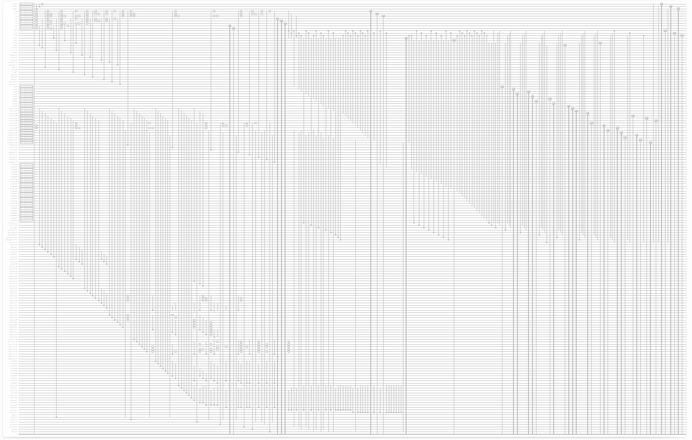
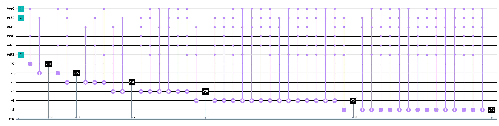

# GISC
## Grid Instruction Set Computer

## Description
GISC is an instruction set architecture designed for the ***general-purpose quantum computer***. Here is the proof of concept with a 8 bits GISC qpu.  

\* For the proof of concept with a classical computer. Please go to ...  

## Blueprint
  

Download: [blueprint.pdf](blueprint.pdf)  

## Simulation
The project is simulated in python3 with Qiskit. Please install the required libraries and repositories before proceeding.


### Requirements
python3: https://www.python.org  
pip:  https://pip.pypa.io  
Qiskit: https://qiskit.org  

### Install Requirements on Linux
Debian/Ubuntu  
```
sudo apt install python3-pip
pip install qiskit
```

### Usage
```
user@computer: cd prototype
user@computer: python3 arch.py
```

## ISA
***Opcode***  
- ***Set***: Assign value to a register
- ***Cpy***: Copy from one grid register to another
- ***Phy***: Copy from one phys register to other grid register
- ***Fly***: Jump to another instruction if the jump condition is true

\* ISA refers to Instruction Set Architecture
\* Grid Registers connect to Grid Registers, Phys Registers and physical layer output  
\* Phys Registers connect to Grid Registers and physical layer input  


| ISA | Dec | Bin | Arch | Usage | Ex. (Dec) |Ex. (Bin)
| :--:|:-:| :-: | :----: | :---- |:-: |:-:|
| Set |1| 01 | <_Set_> <_GRegA_>  <_Value_> | Assign 3 to GReg 1 |1 1 3| 01 001 011 |
| Cpy |2| 10 | <_Cpy_> <_GRegA_>  <_GRegB_> | Copy 3 from GReg 1 to GReg 2 |2 2 1| 10 010 001 |
| Phy |3| 11 | <_Phy_> <_GRegA_>  <_PRegB_> | Copy 3 from PReg 4 to GReg 1 |3 1 4| 11 001 100 |
| Fly |0| 00 | <_Fly_> <_DCare_>  <_DCare_> | Jump to another instruction |0 0 0| 00 000 000 |

\* GReg: Grid Register  
\* PReg: Phys Register  
\* DCare: Don't Care  
\* Dec: Decimal  
\* Bin: Binary  


## Architecture


\* ModAppend: Module Append  
\* ModOpaddr: Module Operation Address  
\* ModISA: Module ISA  
\* ModAlgo: Module Algorithm  
\* ModMeasure: Module Measurement  
\* ModSG: Module Set/Get

------------------------------------------------------------
## Key Components

### Qfe (Quantum Flip Engine)


Demo: [qfe.py](backup/qfe.py)  

Usage:  
```
user@computer: cd backup
user@computer: python3 qfe.py
```
Sample Output:  
```
0b0,0001,1
0b1,0010,2
0b10,0011,3
0b11,0100,4
0b100,0101,5
0b101,0110,6
0b110,0111,7
0b111,1000,8
0b1000,1001,9
0b1001,1010,10
0b1010,1011,11
0b1011,1100,12
0b1100,1101,13
0b1101,1110,14
0b1110,1111,15
0b1111,0000,0
```
Meaning: Qfe iterates from 0 to 15 


### Arithmetic

#### Flip


Demo: [qAlgoFlip.py](backup/qAlgoFlip.py)  

Usage:  
```
user@computer: cd backup
user@computer: python3 qAlgoFlip.py
```

Sample Input:  
```
inputA(0-7):5
inputB(0-7):3
```
Sample Output:  
```
110
6
```
Meaning: 101 f 011 = 110  

#### Mask


Demo: [qAlgoMask.py](backup/qAlgoMask.py)  

Usage:  
```
user@computer: cd backup
user@computer: python3 qAlgoMask.py
```

Sample Input:  
```
inputA(0-7):5
inputB(0-7):3
```
Sample Output:  
```
001
1
```
Meaning: 101 & 011 = 001  


#### Shift


Demo: [qAlgoShift.py](backup/qAlgoShift.py)  

Usage:  
```
user@computer: cd backup
user@computer: python3 qAlgoShift.py
```

Sample Input 1:  
```
inputA(0-7):2
inputB(0-7):0
```
Sample Output 1:  
```
100
4
```
Meaning: 2 << 1 = 4  

Sample Input 2:  
```
inputA(0-7):2
inputB(0-7):1
```
Sample Output 2:  
```
001
1
```
Meaning: 2 >> 1 = 1  

#### Equal to


Demo: [qAlgoEq.py](backup/qAlgoEq.py)  

Usage:  
```
user@computer: cd backup
user@computer: python3 qAlgoEq.py
```

Sample Input 1:  
```
inputA(0-7):5
inputB(0-7):5
```
Sample Output 1:  
```
111
1
```
Meaning: 5 == 5 = 1  

Sample Input 2:  
```
inputA(0-7):6
inputB(0-7):5
```
Sample Output 2:  
```
100
0
```
Meaning: 6 == 5 = 0  

#### Greater Than 


Demo: [qAlgoGt.py](backup/qAlgoGt.py)  

Usage:  
```
user@computer: cd backup
user@computer: python3 qAlgoGt.py
```

Sample Input 1:  
```
inputA(0-7):5
inputB(0-7):5
```
Sample Output 1:  
```
0000
0
```
Meaning: 5 > 5 = 0  

Sample Input 2:  
```
inputA(0-7):6
inputB(0-7):5
```
Sample Output 2:  
```
0001
1
```
Meaning: 6 > 5 = 1  

#### Addition 


Demo: [qAlgoAdd.py](backup/qAlgoAdd.py)  

Usage:  
```
user@computer: cd backup
user@computer: python3 qAlgoAdd.py
```

Sample Input:  
```
inputA(0-7):7
inputB(0-7):6
```
Sample Output:  
```
1101
1
0
1
1
13
```
Meaning: 7+6 = 13  

#### Multiplication  


Demo: [qAlgoMul.py](backup/qAlgoMul.py)  

Usage:  
```
user@computer: cd backup
user@computer: python3 qAlgoMul.py
```

Sample Input:  
```
inputA(0-7):3
inputB(0-7):4
```
Sample Output:  
```
001100
12
```
Meaning: 3*4 = 12  


## 8-bits GISC Quantum Computer Prototype
Codename: Darklain

## Specification
ISA Size: 8 Bits  
Max ISA Address: 8 Operations  
Register Size(Grid & Phy): 3 bit (0-7)  
Number of loops: 10 runs  
Number of Quantum bits: 177  
Number of Classical bits: 66  
Depth of Logic Gates: 104  
Depth of Basis Gates: 7065  

## Key Parameters
|Name|Binary|Decimal|
|:-|-:|:-:|
|OP_SET 		| 01|1|
|OP_CPY 		| 10|2|
|OP_PHY 		| 11|3|
|OP_FLY 		| 00|0|
|QUB_REGA 		|000|0|
|QUB_REGB 		|001|1|
|QUB_SG   		|010|2|
|QUB_INPUTA 	|011|3|
|QUB_INPUTB 	|100|4|
|QUB_F_CON 		|011|3|
|QUB_F_POS 		|100|4|
|QUB_INPUTS 	|101|5|
|QUB_OUTPUTCL	|110|6|
|QUB_OUTPUTCU	|111|7|
|VAL_ZERO 		|000|0|
|VAL_ONE 		|001|1|
|VAL_TWO   		|010|2|
|VAL_THREE 		|011|3|
|VAL_FOUR 		|100|4|
|VAL_FIVE 		|101|5|
|VAL_SIX		|110|6|
|VAL_SEVEN		|111|7|

\* QUB_SG: Qubit Set Get Command  
\* QUB_F_CON: Qubit Fly Condition  
\* QUB_F_Pos: Qubit Fly Position  
\* QUB_OUTPUTCL: Qubit Output C Lower 3 bits  
\* QUB_OUTPUTCU: Qubit Output C Upper 3 bits  


## Sample Input

Math Notation:

$$ A = 2 $$

$$ B = 3 $$

$$ S = CL $$

$$ J = 1 $$

$$ P = 7 $$

$$ F $$

Purpose:  
**To test registers assignment, copying and loop.**
```
SET QUB_INPUTA VAL_TWO  
SET QUB_INPUTB VAL_THREE  
CPY QUB_INPUTS QUB_OUTPUTCL  
SET QUB_F_CON VAL_ONE  
SET QUB_F_POS VAL_SEVEN  
FLY  
FLY  
```
Explain:    
\* Set grid register qub_inputA to 2  
\* Set grid register qub_inputB to 3  
\* Copy grid register qub_inputB from grid register qub_outputcl  
\* Set jump condition to 1  
\* Set jump instruction to 7  
\* Fly  

## Sample Output

```
start
----------------------------
run  1
Current Addr:  0
ISA: OP_SET QUB_INPUTA VAL_TWO 

Result: {'000000000000000000000000000001001011010000000000000010000000000001': 1}
opaddr  1 | 0 0 1
isa  0 1 0 1 1 0 1 0
fly,set,cpy,phy  0 1 0 0
regA  0
regB  0
regSG  0
regInputA  2
regInputB  0
regInputS  0
regOutputCL  0
regOutputCU  0
----------------------------

----------------------------
run  2
Current Addr:  1
ISA: OP_SET QUB_INPUTB VAL_THREE

Result: {'000000000000000000000000000001001100011000000000011010000000000010': 1}
opaddr  2 | 0 1 0
isa  0 1 1 0 0 0 1 1
fly,set,cpy,phy  0 1 0 0
regA  0
regB  0
regSG  0
regInputA  2
regInputB  3
regInputS  0
regOutputCL  0
regOutputCU  0
----------------------------

----------------------------
run  3
Current Addr:  2
ISA: OP_SET QUB_INPUTS VAL_SEVEN

Result: {'000000000000000000000000000001001101111000000111011010000000000011': 1}
opaddr  3 | 0 1 1
isa  0 1 1 0 1 1 1 1
fly,set,cpy,phy  0 1 0 0
regA  0
regB  0
regSG  0
regInputA  2
regInputB  3
regInputS  7
regOutputCL  0
regOutputCU  0
----------------------------

----------------------------
run  4
Current Addr:  3
ISA: OP_CPY QUB_REGA QUB_OUTPUTCL

Result: {'000000000000000000000000000010010000110000110111011010000000110100': 1}
opaddr  4 | 1 0 0
isa  1 0 0 0 0 1 1 0
fly,set,cpy,phy  0 0 1 0
regA  6
regB  0
regSG  0
regInputA  2
regInputB  3
regInputS  7
regOutputCL  6
regOutputCU  0
----------------------------

----------------------------
run  5
Current Addr:  4
ISA: OP_SET QUB_F_CON VAL_ONE

Result: {'000000000000000000000000010001001011001000110111011001000000110101': 1}
opaddr  5 | 1 0 1
isa  0 1 0 1 1 0 0 1
fly,set,cpy,phy  0 1 0 0
regA  6
regB  0
regSG  0
regInputA  1
regInputB  3
regInputS  7
regOutputCL  6
regOutputCU  0
----------------------------

----------------------------
run  6
Current Addr:  5
ISA: OP_SET QUB_F_POS VAL_SEVEN

Result: {'000000000000000000000000011001001100111000011111111001000000110110': 1}
opaddr  6 | 1 1 0
isa  0 1 1 0 0 1 1 1
fly,set,cpy,phy  0 1 0 0
regA  6
regB  0
regSG  0
regInputA  1
regInputB  7
regInputS  7
regOutputCL  3
regOutputCU  0
----------------------------

----------------------------
run  7
Current Addr:  6
ISA: OP_FLY VAL_ZERO VAL_ZERO

Result: {'000000000000000000000000111000100000000000111111111001000000110111': 1}
opaddr  7 | 1 1 1
isa  0 0 0 0 0 0 0 0
fly,set,cpy,phy  1 0 0 0
regA  6
regB  0
regSG  0
regInputA  1
regInputB  7
regInputS  7
regOutputCL  7
regOutputCU  0
----------------------------

----------------------------
run  8
Current Addr:  7
ISA: OP_FLY VAL_ZERO VAL_ZERO

Result: {'000000000000000000000000000000100000000000111111111001000000110111': 1}
opaddr  7 | 1 1 1
isa  0 0 0 0 0 0 0 0
fly,set,cpy,phy  1 0 0 0
regA  6
regB  0
regSG  0
regInputA  1
regInputB  7
regInputS  7
regOutputCL  7
regOutputCU  0
----------------------------

----------------------------
run  9
Current Addr:  7
ISA: OP_FLY VAL_ZERO VAL_ZERO

Result: {'000000000000000000000000000000100000000000111111111001000000110111': 1}
opaddr  7 | 1 1 1
isa  0 0 0 0 0 0 0 0
fly,set,cpy,phy  1 0 0 0
regA  6
regB  0
regSG  0
regInputA  1
regInputB  7
regInputS  7
regOutputCL  7
regOutputCU  0
----------------------------

----------------------------
run  10
Current Addr:  7
ISA: OP_FLY VAL_ZERO VAL_ZERO

Result: {'000000000000000000000000000000100000000000111111111001000000110111': 1}
opaddr  7 | 1 1 1
isa  0 0 0 0 0 0 0 0
fly,set,cpy,phy  1 0 0 0
regA  6
regB  0
regSG  0
regInputA  1
regInputB  7
regInputS  7
regOutputCL  7
regOutputCU  0
----------------------------

Type of gates
	 x 158
	 mcx 103
	 state_preparation 59
	 cx 58
	 ccx 58
	 cswap 56
	 measure 42
	 mcx_gray 31
	 barrier 1
	 swap 1
Non-local gates:  307
Number of Quantum bits:  177
Number of Classical bits:  66
Depth:  104
Depth(basis gates):  7065
End


```
## Coupling Map

GISC uses grid architecture as coupling map.


The mapping routs clockwise, in which starts from the middle and ends at the bottom right corner.


|QB|Qubit Mapping|
|:-|:-|
|0|opaddr0|
|1|opaddr1|
|2|opaddr2|
|3|isa0|
|4|isa1|
|5|isa2|
|6|isa3|
|7|isa4|
|8|isa5|
|9|isa6|
|10|isa7|
|11|dmy0|
|12|dmy1|
|13|dmy2|
|14|op_set|
|15|op_cpy|
|16|op_phy|
|17|op_fly|
|18|opa_regA|
|19|opa_regB|
|20|opa_SG|
|21|opa_inputA|
|22|opa_inputB|
|23|opa_inputS|
|24|opa_outputCL|
|25|opa_outputCU|
|26|opb_regA|
|27|opb_regB|
|28|opb_SG|
|29|opb_inputA|
|30|opb_inputB|
|31|opb_inputS|
|32|opb_outputCL|
|33|opb_outputCU|
|34|qreg_a0|
|35|qreg_a1|
|36|qreg_a2|
|37|qreg_b0|
|38|qreg_b1|
|39|qreg_b2|
|40|qreg_sg0|
|41|qreg_sg1|
|42|qreg_sg2|
|43|qreg_inputA0|
|44|qreg_inputA1|
|45|qreg_inputA2|
|46|qreg_inputB0|
|47|qreg_inputB1|
|48|qreg_inputB2|
|49|qreg_inputS0|
|50|qreg_inputS1|
|51|qreg_inputS2|
|52|qreg_outputCL0|
|53|qreg_outputCL1|
|54|qreg_outputCL2|
|55|qreg_outputCU0|
|56|qreg_outputCU1|
|57|qreg_outputCU2|
|58|opb_phy_regA|
|59|opb_phy_regB|
|60|opb_phy_regC|
|61|opb_phy_regD|
|62|opb_phy_regE|
|63|opb_phy_regF|
|64|opb_phy_regG|
|65|opb_phy_regH|
|66|qreg_phy_a0|
|67|qreg_phy_a1|
|68|qreg_phy_a2|
|69|qreg_phy_b0|
|70|qreg_phy_b1|
|71|qreg_phy_b2|
|72|qreg_phy_c0|
|73|qreg_phy_c1|
|74|qreg_phy_c2|
|75|qreg_phy_d0|
|76|qreg_phy_d1|
|77|qreg_phy_d2|
|78|qreg_phy_e0|
|79|qreg_phy_e1|
|80|qreg_phy_e2|
|81|qreg_phy_f0|
|82|qreg_phy_f1|
|83|qreg_phy_f2|
|84|qreg_phy_g0|
|85|qreg_phy_g1|
|86|qreg_phy_g2|
|87|qreg_phy_h0|
|88|qreg_phy_h1|
|89|qreg_phy_h2|
|90|op_swap_regA|
|91|op_swap_regB|
|92|op_swap_SG|
|93|op_swap_inputA|
|94|op_swap_inputB|
|95|op_swap_inputS|
|96|op_swap_outputCL|
|97|op_swap_outputCU|
|98|op_jmp_swap|
|99|algo_flipA0|
|100|algo_flipA1|
|101|algo_flipA2|
|102|algo_flipB0|
|103|algo_flipB1|
|104|algo_flipB2|
|105|algo_flipC0|
|106|algo_flipC1|
|107|algo_flipC2|
|108|algo_maskA0|
|109|algo_maskA1|
|110|algo_maskA2|
|111|algo_maskB0|
|112|algo_maskB1|
|113|algo_maskB2|
|114|algo_maskC0|
|115|algo_maskC1|
|116|algo_maskC2|
|117|algo_shiftA0|
|118|algo_shiftA1|
|119|algo_shiftA2|
|120|algo_shiftB0|
|121|algo_shiftB1|
|122|algo_shiftB2|
|123|algo_shiftC0|
|124|algo_shiftC1|
|125|algo_shiftC2|
|126|algo_shiftD0|
|127|algo_shiftD1|
|128|algo_equalA0|
|129|algo_equalA1|
|130|algo_equalA2|
|131|algo_equalB0|
|132|algo_equalB1|
|133|algo_equalB2|
|134|algo_equalC0|
|135|algo_equalC1|
|136|algo_equalC2|
|137|algo_equalD0|
|138|algo_greaterA0|
|139|algo_greaterA1|
|140|algo_greaterA2|
|141|algo_greaterB0|
|142|algo_greaterB1|
|143|algo_greaterB2|
|144|algo_greaterC0|
|145|algo_greaterC1|
|146|algo_greaterC2|
|147|algo_addA0|
|148|algo_addA1|
|149|algo_addA2|
|150|algo_addB0|
|151|algo_addB1|
|152|algo_addB2|
|153|algo_addC0|
|154|algo_addC1|
|155|algo_addC2|
|156|algo_addD0|
|157|algo_mulA0|
|158|algo_mulA1|
|159|algo_mulA2|
|160|algo_mulB0|
|161|algo_mulB1|
|162|algo_mulB2|
|163|algo_mulC0|
|164|algo_mulC1|
|165|algo_mulC2|
|166|algo_mulC4|
|167|algo_mulC5|
|168|algo_mulC6|
|169|algo_idleS|
|170|algo_flipS|
|171|algo_maskS|
|172|algo_shiftS|
|173|algo_equalS|
|174|algo_greaterS|
|175|algo_addS|
|176|algo_mulS|

This is how the grid looks after mapping with qubits.


2D - 2 Dimensions
3D - 3 Dimensions

## Device Architecture

Grid-like Coupling Architecture

Neutral Atoms

If Total Basic gates exceeds maximum depth
	split to 2 or 3 sectors
	
optimize the circuit to reduce the number of swap gates 

Mapping Table for qubits

## Future
GISC is capable of contructing 16 bits, 32 bits or 64 bits architecture

Todo

Sample Input

Comment Code snippet line by line

Explain Algorithm

Reference:
https://link.springer.com/article/10.1007/s11128-020-02873-5 (Grid-like Coupling Architecture)


