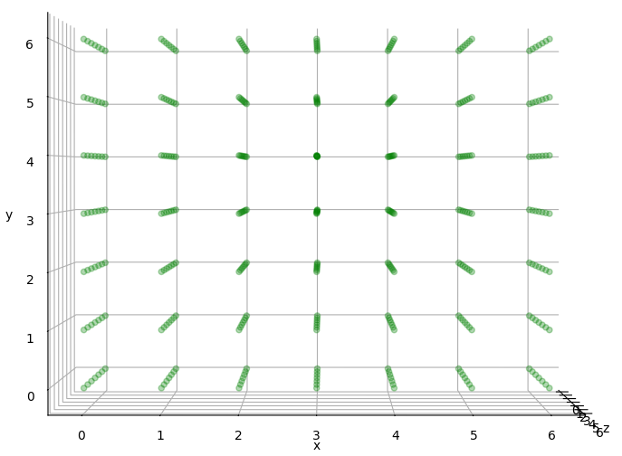
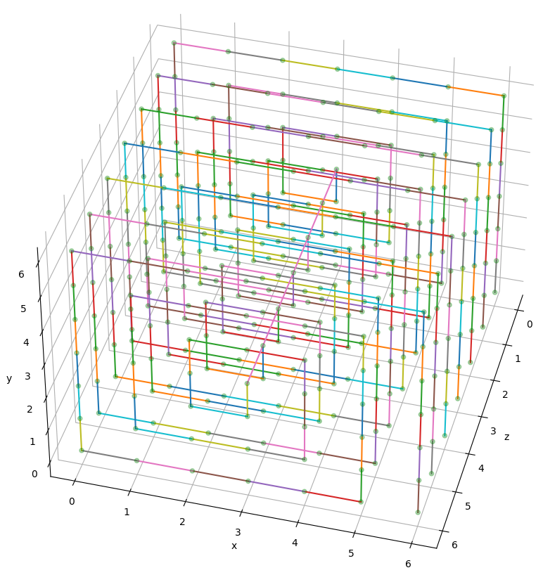

# GISC
## Grid Instruction Set Computer

## Description
GISC is an instruction set architecture designed for the ***generative quantum computer***. Here is the proof of concept with a 3 bits GISC qpu. 

## Blueprint
  

Download: [blueprint.pdf](blueprint.pdf)  

## Simulation
The project is simulated in python3 with Qiskit. Please install the required libraries and repositories before proceeding.


### Requirements
python3: https://www.python.org  
pip:  https://pip.pypa.io  
Qiskit: https://qiskit.org  

### Install Requirements on Linux
Debian/Ubuntu  
```
sudo apt install python3-pip
pip install qiskit
```

### Usage

#### Regular version (Without ML)
```
user@computer: cd prototype
user@computer: python3 arch.py
```

#### AI version (With ML)
```
user@computer: cd prototypeML
user@computer: python3 arch.py
```

## ISA
***Opcode***  
- ***Set***: Assign value to a register
- ***Cpy***: Copy from one grid register to another
- ***Phy***: Copy from one phys register to other grid register
- ***Fly***: Jump to another instruction if the jump condition is true

\* ISA refers to Instruction Set Architecture
\* Grid Registers connect to Grid Registers, Phys Registers and physical layer output  
\* Phys Registers connect to Grid Registers and physical layer input  


| ISA | Dec | Bin | Arch | Usage | Ex. (Dec) |Ex. (Bin)
| :--:|:-:| :-: | :----: | :---- |:-: |:-:|
| Set |1| 01 | <_Set_> <_GRegA_>  <_Value_> | Assign 3 to GReg 1 |1 1 3| 01 001 011 |
| Cpy |2| 10 | <_Cpy_> <_GRegA_>  <_GRegB_> | Copy 3 from GReg 1 to GReg 2 |2 2 1| 10 010 001 |
| Phy |3| 11 | <_Phy_> <_GRegA_>  <_PRegB_> | Copy 3 from PReg 4 to GReg 1 |3 1 4| 11 001 100 |
| Fly |0| 00 | <_Fly_> <_DCare_>  <_DCare_> | Jump to another instruction |0 0 0| 00 000 000 |

\* GReg: Grid Register  
\* PReg: Phys Register  
\* DCare: Don't Care  
\* Dec: Decimal  
\* Bin: Binary  


## Architecture


\* ModAppend: Module Append  
\* ModOpaddr: Module Operation Address  
\* ModISA: Module ISA  
\* ModAlgo: Module Algorithm  
\* ModMeasure: Module Measurement  
\* ModSG: Module Set/Get

------------------------------------------------------------
## Key Components

### Qfe (Quantum Flip Engine)
$$ Q = Q + 1 $$


Demo: [qfe.py](backup/qfe.py)  

Usage:  
```
user@computer: cd backup
user@computer: python3 qfe.py
```
Sample Output:  
```
0b0,0001,1
0b1,0010,2
0b10,0011,3
0b11,0100,4
0b100,0101,5
0b101,0110,6
0b110,0111,7
0b111,1000,8
0b1000,1001,9
0b1001,1010,10
0b1010,1011,11
0b1011,1100,12
0b1100,1101,13
0b1101,1110,14
0b1110,1111,15
0b1111,0000,0
```
Explain: Qfe iterates from 0 to 15 


11 0
10 1
01 1
00 0

### Arithmetic

#### Flip

$$ C = A \wedge B  $$


Demo: [qAlgoFlip.py](backup/qAlgoFlip.py)  

Usage:  
```
user@computer: cd backup
user@computer: python3 qAlgoFlip.py
```

Sample Input:  
```
inputA(0-7):5
inputB(0-7):3
```
Sample Output:  
```
110
6
```
Explain: 101 f 011 = 110  

#### Mask

$$ C = A \ and \ B $$


Demo: [qAlgoMask.py](backup/qAlgoMask.py)  

Usage:  
```
user@computer: cd backup
user@computer: python3 qAlgoMask.py
```

Sample Input:  
```
inputA(0-7):5
inputB(0-7):3
```
Sample Output:  
```
001
1
```
Explain: 101 & 011 = 001  


#### Shift
$$ C = B[0] \ ? \ A >> 1 \ : \ A << 1 $$


Demo: [qAlgoShift.py](backup/qAlgoShift.py)  

Usage:  
```
user@computer: cd backup
user@computer: python3 qAlgoShift.py
```

Sample Input 1:  
```
inputA(0-7):2
inputB(0-7):0
```
Sample Output 1:  
```
100
4
```
Explain: 2 << 1 = 4  

Sample Input 2:  
```
inputA(0-7):2
inputB(0-7):1
```
Sample Output 2:  
```
001
1
```
Explain: 2 >> 1 = 1  

#### Equal to
$$ C = (A == B) $$


Demo: [qAlgoEq.py](backup/qAlgoEq.py)  

Usage:  
```
user@computer: cd backup
user@computer: python3 qAlgoEq.py
```

Sample Input 1:  
```
inputA(0-7):5
inputB(0-7):5
```
Sample Output 1:  
```
111
1
```
Explain: 5 == 5 = 1  

Sample Input 2:  
```
inputA(0-7):6
inputB(0-7):5
```
Sample Output 2:  
```
100
0
```
Explain: 6 == 5 = 0  

#### Greater Than 

$$ C = A > B $$


Demo: [qAlgoGt.py](backup/qAlgoGt.py)  

Usage:  
```
user@computer: cd backup
user@computer: python3 qAlgoGt.py
```

Sample Input 1:  
```
inputA(0-7):5
inputB(0-7):5
```
Sample Output 1:  
```
0000
0
```
Explain: 5 > 5 = 0  

Sample Input 2:  
```
inputA(0-7):6
inputB(0-7):5
```
Sample Output 2:  
```
0001
1
```
Explain: 6 > 5 = 1  

#### Addition 
$$ C = A + B $$


Demo: [qAlgoAdd.py](backup/qAlgoAdd.py)  

Usage:  
```
user@computer: cd backup
user@computer: python3 qAlgoAdd.py
```

Sample Input:  
```
inputA(0-7):7
inputB(0-7):6
```
Sample Output:  
```
1101
1
0
1
1
13
```
Explain: 7+6 = 13  

#### Multiplication  
$$ C = A * B $$


Demo: [qAlgoMul.py](backup/qAlgoMul.py)  

Usage:  
```
user@computer: cd backup
user@computer: python3 qAlgoMul.py
```

Sample Input:  
```
inputA(0-7):3
inputB(0-7):4
```
Sample Output:  
```
001100
12
```
Explain: 3*4 = 12  

### Machine Learning

#### Angle versus Probablity

$$ P = N(D) $$

P: Probability
D: Degree
N: Normalize


Demo: [avp.py](backup/ml/avp.py)  

Usage:  
```
user@computer: cd backup/ml
user@computer: python3 avp.py
```
Sample Input/Output:  
```
Rotated Angle: 45

Expected Measured probablity:  14.645%
Expected Normalized Probability: 25.000%
Result:  {'1': 14785, '0': 85215}

Actual Measured Probability: 14.785%
Actual Normalized Probability: 25.126%
Error Rate:  0.502%

```
Explain: 45 degree is equalvalent to 25% hitting rate.

In Depth

|Degree|Probability|
|:-|-:|
|45 		| ~25%|
|90 		| ~50%|
|135 		| ~75%|
|180 		| ~100%|

#### QML Mapping


Demo: [qml_mapping.py](backup/ml/qml_mapping.py)  

Usage:  
```
user@computer: cd backup/ml/qml_mapping
user@computer: python3 qml_mapping.py
```
Sample Input/Output:  
```
Purple Image finder 
Description: Check if the image is purple

Original Image:
px0 [ 128.0 0.0 112.0 ]
px1 [ 130.0 100.0 132.0 ]
px2 [ 150.0 20.0 160.0 ]
px3 [ 150.0 40.0 100.0 ]

Normalized Image:
px0 [ 1.58 0.00 1.38 ]
px1 [ 1.60 1.23 1.63 ]
px2 [ 1.85 0.25 1.97 ]
px3 [ 1.85 0.49 1.23 ]

Original Weight [ 139.50 40.00 126.00 ]

Normalized Weight [ 1.69 0.32 1.51 ]

Probability of Matching 88.19 %

Matched: Kinda
```
Explain: The purple image finder maps the pre-calcuated weight to determine whether the 2x2 image is purple color or not.

#### QML Learning


Demo: [qml_learning.py](backup/ml/qml_learning.py)  

Usage:  
```
user@computer: cd backup/ml/qml_learning
user@computer: python3 qml_learning.py
```
Sample Input/Output:  
```
Purple Image Trainer 
Description: Find the decent weight

Training ...

Group  0

r:  [506, 250, 76, 57, 114, 261, 488]
g:  [127, 158, 284, 468, 628, 749, 792]
b:  [504, 388, 268, 227, 251, 377, 497]

index of desired r,g,b:  3 0 3

Group  1

r:  [486, 218, 81, 41, 116, 273, 470]
g:  [106, 154, 269, 466, 637, 758, 794]
b:  [521, 379, 283, 250, 283, 368, 484]

index of desired r,g,b:  3 0 3

Group  2

r:  [507, 231, 82, 51, 126, 276, 474]
g:  [136, 167, 283, 466, 623, 769, 805]
b:  [523, 378, 281, 254, 292, 363, 482]

index of desired r,g,b:  3 0 3

Group  3

r:  [504, 227, 85, 54, 119, 254, 505]
g:  [114, 129, 266, 468, 631, 747, 813]
b:  [520, 375, 275, 237, 280, 367, 462]

index of desired r,g,b:  3 0 3
Weight for the Target Model are 1.57 0.00 1.57


```
Explain: The purple image trainer demostrates how to train a purple image pixel finder.

## 8-bits GISC Quantum Computer Prototype (w/o ML)
Codename: Darklain

### Specification
ISA Size: 8 Bits  
Max ISA Address: 8 Operations  
Register Size(Grid & Phy): 3 bit (0-7)  
Number of loops: 10 runs  
Number of Quantum bits: 177  
Number of Classical bits: 66  
Depth of Logic Gates: 104  
Depth of Basis Gates: 7065  

### Key Parameters
|Name|Binary|Decimal|
|:-|-:|:-:|
|OP_SET 		| 01|1|
|OP_CPY 		| 10|2|
|OP_PHY 		| 11|3|
|OP_FLY 		| 00|0|
|QUB_REGA 		|000|0|
|QUB_REGB 		|001|1|
|QUB_SG   		|010|2|
|QUB_INPUTA 	|011|3|
|QUB_INPUTB 	|100|4|
|QUB_F_CON 		|011|3|
|QUB_F_POS 		|100|4|
|QUB_INPUTS 	|101|5|
|QUB_OUTPUTCL	|110|6|
|QUB_OUTPUTCU	|111|7|
|VAL_ZERO 		|000|0|
|VAL_ONE 		|001|1|
|VAL_TWO   		|010|2|
|VAL_THREE 		|011|3|
|VAL_FOUR 		|100|4|
|VAL_FIVE 		|101|5|
|VAL_SIX		|110|6|
|VAL_SEVEN		|111|7|

\* QUB_SG: Qubit Set Get Command  
\* QUB_F_CON: Qubit Fly Condition  
\* QUB_F_Pos: Qubit Fly Position  
\* QUB_OUTPUTCL: Qubit Output C Lower 3 bits  
\* QUB_OUTPUTCU: Qubit Output C Upper 3 bits  

### Sample Input

Math Notation:

$$ A = 2 $$

$$ B = 3 $$

$$ S = CL $$

$$ J = 1 $$

$$ P = 7 $$

$$ F $$

Purpose:  
**To test registers assignment, copying and loop.**
```
SET QUB_INPUTA VAL_TWO  
SET QUB_INPUTB VAL_THREE  
CPY QUB_INPUTS QUB_OUTPUTCL  
SET QUB_F_CON VAL_ONE  
SET QUB_F_POS VAL_SEVEN  
FLY  
FLY  
```
Explain:    
\* Set grid register qub_inputA to 2  
\* Set grid register qub_inputB to 3  
\* Copy grid register qub_inputB from grid register qub_outputcl  
\* Set jump condition to 1  
\* Set jump instruction to 7  
\* Fly  

### Sample Output

```
start
----------------------------
run  1
Current Addr:  0
ISA: OP_SET QUB_INPUTA VAL_TWO 

Result: {'000000000000000000000000000001001011010000000000000010000000000001': 1}
opaddr  1 | 0 0 1
isa  0 1 0 1 1 0 1 0
fly,set,cpy,phy  0 1 0 0
regA  0
regB  0
regSG  0
regInputA  2
regInputB  0
regInputS  0
regOutputCL  0
regOutputCU  0
----------------------------

----------------------------
run  2
Current Addr:  1
ISA: OP_SET QUB_INPUTB VAL_THREE

Result: {'000000000000000000000000000001001100011000000000011010000000000010': 1}
opaddr  2 | 0 1 0
isa  0 1 1 0 0 0 1 1
fly,set,cpy,phy  0 1 0 0
regA  0
regB  0
regSG  0
regInputA  2
regInputB  3
regInputS  0
regOutputCL  0
regOutputCU  0
----------------------------

----------------------------
run  3
Current Addr:  2
ISA: OP_SET QUB_INPUTS VAL_SEVEN

Result: {'000000000000000000000000000001001101111000000111011010000000000011': 1}
opaddr  3 | 0 1 1
isa  0 1 1 0 1 1 1 1
fly,set,cpy,phy  0 1 0 0
regA  0
regB  0
regSG  0
regInputA  2
regInputB  3
regInputS  7
regOutputCL  0
regOutputCU  0
----------------------------

----------------------------
run  4
Current Addr:  3
ISA: OP_CPY QUB_REGA QUB_OUTPUTCL

Result: {'000000000000000000000000000010010000110000110111011010000000110100': 1}
opaddr  4 | 1 0 0
isa  1 0 0 0 0 1 1 0
fly,set,cpy,phy  0 0 1 0
regA  6
regB  0
regSG  0
regInputA  2
regInputB  3
regInputS  7
regOutputCL  6
regOutputCU  0
----------------------------

----------------------------
run  5
Current Addr:  4
ISA: OP_SET QUB_F_CON VAL_ONE

Result: {'000000000000000000000000010001001011001000110111011001000000110101': 1}
opaddr  5 | 1 0 1
isa  0 1 0 1 1 0 0 1
fly,set,cpy,phy  0 1 0 0
regA  6
regB  0
regSG  0
regInputA  1
regInputB  3
regInputS  7
regOutputCL  6
regOutputCU  0
----------------------------

----------------------------
run  6
Current Addr:  5
ISA: OP_SET QUB_F_POS VAL_SEVEN

Result: {'000000000000000000000000011001001100111000011111111001000000110110': 1}
opaddr  6 | 1 1 0
isa  0 1 1 0 0 1 1 1
fly,set,cpy,phy  0 1 0 0
regA  6
regB  0
regSG  0
regInputA  1
regInputB  7
regInputS  7
regOutputCL  3
regOutputCU  0
----------------------------

----------------------------
run  7
Current Addr:  6
ISA: OP_FLY VAL_ZERO VAL_ZERO

Result: {'000000000000000000000000111000100000000000111111111001000000110111': 1}
opaddr  7 | 1 1 1
isa  0 0 0 0 0 0 0 0
fly,set,cpy,phy  1 0 0 0
regA  6
regB  0
regSG  0
regInputA  1
regInputB  7
regInputS  7
regOutputCL  7
regOutputCU  0
----------------------------

----------------------------
run  8
Current Addr:  7
ISA: OP_FLY VAL_ZERO VAL_ZERO

Result: {'000000000000000000000000000000100000000000111111111001000000110111': 1}
opaddr  7 | 1 1 1
isa  0 0 0 0 0 0 0 0
fly,set,cpy,phy  1 0 0 0
regA  6
regB  0
regSG  0
regInputA  1
regInputB  7
regInputS  7
regOutputCL  7
regOutputCU  0
----------------------------

----------------------------
run  9
Current Addr:  7
ISA: OP_FLY VAL_ZERO VAL_ZERO

Result: {'000000000000000000000000000000100000000000111111111001000000110111': 1}
opaddr  7 | 1 1 1
isa  0 0 0 0 0 0 0 0
fly,set,cpy,phy  1 0 0 0
regA  6
regB  0
regSG  0
regInputA  1
regInputB  7
regInputS  7
regOutputCL  7
regOutputCU  0
----------------------------

----------------------------
run  10
Current Addr:  7
ISA: OP_FLY VAL_ZERO VAL_ZERO

Result: {'000000000000000000000000000000100000000000111111111001000000110111': 1}
opaddr  7 | 1 1 1
isa  0 0 0 0 0 0 0 0
fly,set,cpy,phy  1 0 0 0
regA  6
regB  0
regSG  0
regInputA  1
regInputB  7
regInputS  7
regOutputCL  7
regOutputCU  0
----------------------------

Type of gates
	 x 158
	 mcx 103
	 state_preparation 59
	 cx 58
	 ccx 58
	 cswap 56
	 measure 42
	 mcx_gray 31
	 barrier 1
	 swap 1
Non-local gates:  307
Number of Quantum bits:  177
Number of Classical bits:  66
Depth:  104
Depth(basis gates):  7065
End


```
## 8-bits GISC Quantum Computer Prototype (w ML)

### Sample Input

Math Notation:

$$ SG = 4 $$

$$ F $$

$$ F $$

$$ F $$

$$ F $$

$$ SG= 0 $$

Purpose:  
**Goes thru a training process for 5 runs, then maps the generated weight to the sample and see the result.**
```
SET QUB_SG VAL_FOUR
FLY
FLY
FLY
FLY
SET QUB_SG VAL_ZERO  

```
Explain:    
\* Set grid register qub_sg to 4 (Trigger the Machine Training)  
\* Fly  
\* Fly  
\* Fly  
\* Fly  
\* Set grid register qub_sg to 0 (Trigger the Machine Mapping) 
\* Copy grid register qub_inputB from grid register qub_outputcl  

### Sample Output

```
start
----------------------------
run  1
Current Addr:  0
ISA: OP_SET QUB_SG VAL_FOUR 

Result: {'000000000000000000000000000001001010100000000000000000100000000001': 10}
opaddr  1 | 0 0 1
isa  0 1 0 1 0 1 0 0
fly,set,cpy,phy  0 1 0 0
regA  0
regB  0
regSG  4
regInputA  0
regInputB  0
regInputS  0
regOutputCL  0
regOutputCU  0
----------------------------

State: Training

Training Group:  0

r:  [467, 214, 87, 60, 121, 299, 517]
g:  [128, 166, 277, 471, 638, 756, 800]
b:  [489, 352, 276, 229, 313, 400, 519]

index of desired r,g,b:  3 0 3
----------------------------
run  2
Current Addr:  1
ISA: OP_FLY QUB_REGA VAL_ZERO 

Result: {'000000000000000000000000000000100000000000000000000000100000000010': 10}
opaddr  2 | 0 1 0
isa  0 0 0 0 0 0 0 0
fly,set,cpy,phy  1 0 0 0
regA  0
regB  0
regSG  4
regInputA  0
regInputB  0
regInputS  0
regOutputCL  0
regOutputCU  0
----------------------------

State: Training

Training Group:  1

r:  [500, 229, 81, 62, 108, 244, 480]
g:  [110, 143, 273, 465, 645, 794, 840]
b:  [507, 357, 253, 231, 280, 374, 511]

index of desired r,g,b:  3 0 3
----------------------------
run  3
Current Addr:  2
ISA: OP_FLY QUB_REGA VAL_ZERO 

Result: {'000000000000000000000000000000100000000000000000000000100000000011': 10}
opaddr  3 | 0 1 1
isa  0 0 0 0 0 0 0 0
fly,set,cpy,phy  1 0 0 0
regA  0
regB  0
regSG  4
regInputA  0
regInputB  0
regInputS  0
regOutputCL  0
regOutputCU  0
----------------------------

State: Training

Training Group:  2

r:  [508, 242, 81, 52, 117, 257, 467]
g:  [105, 167, 287, 459, 637, 765, 797]
b:  [507, 375, 277, 234, 275, 364, 495]

index of desired r,g,b:  3 0 3
----------------------------
run  4
Current Addr:  3
ISA: OP_FLY QUB_REGA VAL_ZERO 

Result: {'000000000000000000000000000000100000000000000000000000100000000100': 10}
opaddr  4 | 1 0 0
isa  0 0 0 0 0 0 0 0
fly,set,cpy,phy  1 0 0 0
regA  0
regB  0
regSG  4
regInputA  0
regInputB  0
regInputS  0
regOutputCL  0
regOutputCU  0
----------------------------

State: Training

Training Group:  3

r:  [492, 222, 82, 48, 112, 270, 512]
g:  [126, 156, 273, 492, 647, 772, 818]
b:  [517, 357, 260, 246, 279, 362, 515]

index of desired r,g,b:  3 0 3
----------------------------
run  5
Current Addr:  4
ISA: OP_FLY QUB_REGA VAL_ZERO 

Result: {'000000000000000000000000000000100000000000000000000000100000000101': 10}
opaddr  5 | 1 0 1
isa  0 0 0 0 0 0 0 0
fly,set,cpy,phy  1 0 0 0
regA  0
regB  0
regSG  4
regInputA  0
regInputB  0
regInputS  0
regOutputCL  0
regOutputCU  0
----------------------------

State: Training

Calculating the weight ...
The weight for the Target Model are 1.57 0.00 1.57
----------------------------
run  6
Current Addr:  5
ISA: OP_SET QUB_SG VAL_ZERO 

Result: {'000000000000000000000000100001001010000000000000000000000000000110': 10}
opaddr  6 | 1 1 0
isa  0 1 0 1 0 0 0 0
fly,set,cpy,phy  0 1 0 0
regA  0
regB  0
regSG  0
regInputA  0
regInputB  0
regInputS  0
regOutputCL  0
regOutputCU  0
----------------------------

State: Mapping

[[1.84799568 0.49279885 1.50303649]
 [1.68783605 0.32031925 1.50303649]
 [1.58927628 0.23407945 1.50303649]
 [1.63855617 0.32031925 1.50303649]]
[1.57079633 0.         1.57079633]
{'10000': 27, '00000': 973}

Probability of Matching 89.49 %

Matched: 85%
----------------------------
run  7
Current Addr:  6
ISA: OP_FLY QUB_REGA VAL_ZERO 

Result: {'000000000000000000000000000000100000000000000000000000000000000111': 10}
opaddr  7 | 1 1 1
isa  0 0 0 0 0 0 0 0
fly,set,cpy,phy  1 0 0 0
regA  0
regB  0
regSG  0
regInputA  0
regInputB  0
regInputS  0
regOutputCL  0
regOutputCU  0
----------------------------

State: Mapping

[[1.84799568 0.49279885 1.50303649]
 [1.68783605 0.32031925 1.50303649]
 [1.58927628 0.23407945 1.50303649]
 [1.63855617 0.32031925 1.50303649]]
[1.57079633 0.         1.57079633]
{'10000': 21, '00000': 979}

Probability of Matching 90.74 %

Matched: 90%
----------------------------
run  8
Current Addr:  7
ISA: OP_FLY QUB_REGA VAL_ZERO 

Result: {'000000000000000000000000000000100000000000000000000000000000000000': 10}
opaddr  0 | 0 0 0
isa  0 0 0 0 0 0 0 0
fly,set,cpy,phy  1 0 0 0
regA  0
regB  0
regSG  0
regInputA  0
regInputB  0
regInputS  0
regOutputCL  0
regOutputCU  0
----------------------------

State: Mapping

[[1.84799568 0.49279885 1.50303649]
 [1.68783605 0.32031925 1.50303649]
 [1.58927628 0.23407945 1.50303649]
 [1.63855617 0.32031925 1.50303649]]
[1.57079633 0.         1.57079633]
{'10000': 18, '00000': 982}

Probability of Matching 91.43 %

Matched: 90%

Type of gates
	 x 158
	 mcx 103
	 state_preparation 59
	 cx 58
	 ccx 58
	 cswap 56
	 measure 42
	 mcx_gray 31
	 barrier 1
	 swap 1
Non-local gates:  307
Number of Quantum bits:  177
Number of Classical bits:  66
Depth:  104
Depth(basis gates):  7065
End


```

## Device Architecture

### 2D Coupling Map
16x16 2D Grid

GISC uses grid architecture as coupling map.


The mapping routs clockwise, in which starts from the middle and ends at the bottom right corner.


### Qubits Table for the Coupling Map
|QB|0-15|16-31|32-47|48-63|64-79|80-95|96-111|112-127|128-143|144-159|160-177|178-191|192-207|208-223|224-239|240-255
|:-|:-|:-|:-|:-|:-|:-|:-|:-|:-|:-|:-|:-|:-|:-|:-|:-|
|0|opaddr0|op_phy|opb_outputCL|qreg_inputB2|opb_phy_regG|qreg_phy_e2|op_swap_outputCL|algo_maskB1|algo_equalA0|algo_greaterC0|algo_mulB0|algo_mulS|
|1|opaddr1|op_fly|opb_outputCU|qreg_inputS0|opb_phy_regH|qreg_phy_f0|op_swap_outputCU|algo_maskB2|algo_equalA1|algo_greaterC1|algo_mulB1|
|2|opaddr2|opa_regA|qreg_a0|qreg_inputS1|qreg_phy_a0|qreg_phy_f1|op_jmp_swap|algo_maskC0|algo_equalA2|algo_greaterC2|algo_mulB2
|3|isa0|opa_regB|qreg_a1|qreg_inputS2|qreg_phy_a1|qreg_phy_f2|algo_flipA0|algo_maskC1|algo_equalB0|algo_addA0|algo_mulC0
|4|isa1|opa_SG|qreg_a2|qreg_outputCL0|qreg_phy_a2|qreg_phy_g0|algo_flipA1|algo_maskC2|algo_equalB1|algo_addA1|algo_mulC1
|5|isa2|opa_inputA|qreg_b0|qreg_outputCL1|qreg_phy_b0|qreg_phy_g1|algo_flipA2|algo_shiftA0|algo_equalB2|algo_addA2|algo_mulC2
|6|isa3|opa_inputB|qreg_b1|qreg_outputCL2|qreg_phy_b1|qreg_phy_g2|algo_flipB0|algo_shiftA1|algo_equalC0|algo_addB0|algo_mulC4
|7|isa4|opa_inputS|qreg_b2|qreg_outputCU0|qreg_phy_b2|qreg_phy_h0|algo_flipB1|algo_shiftA2|algo_equalC1|algo_addB1|algo_mulC5
|8|isa5|opa_outputCL|qreg_sg0|qreg_outputCU1|qreg_phy_c0|qreg_phy_h1|algo_flipB2|algo_shiftB0|algo_equalC2|algo_addB2|algo_mulC6|
|9|isa6|opa_outputCU|qreg_sg1|qreg_outputCU2|qreg_phy_c1|qreg_phy_h2|algo_flipC0|algo_shiftB1|algo_equalD0|algo_addC0|algo_idleS|
|A|isa7|opb_regA|qreg_sg2|opb_phy_regA|qreg_phy_c2|op_swap_regA|algo_flipC1|algo_shiftB2|algo_greaterA0|algo_addC1|algo_flipS
|B|dmy0|opb_regB|qreg_inputA0|opb_phy_regB|qreg_phy_d0|op_swap_regB|algo_flipC2|algo_shiftC0|algo_greaterA1|algo_addC2|algo_maskS|
|C|dmy1|opb_SG|qreg_inputA1|opb_phy_regC|qreg_phy_d1|op_swap_SG|algo_maskA0|algo_shiftC1|algo_greaterA2|algo_addD0|algo_shiftS
|D|dmy2|opb_inputA|qreg_inputA2|opb_phy_regD|qreg_phy_d2|op_swap_inputA|algo_maskA1|algo_shiftC2|algo_greaterB0|algo_mulA0|algo_equalS|
|E|op_set|opb_inputB|qreg_inputB0|opb_phy_regE|qreg_phy_e0|op_swap_inputB|algo_maskA2|algo_shiftD0|algo_greaterB1|algo_mulA1|algo_greaterS|
|F|op_cpy|opb_inputS|qreg_inputB1|opb_phy_regF|qreg_phy_e1|op_swap_inputS|algo_maskB0|algo_shiftD1|algo_greaterB2|algo_mulA2|algo_addS|


This is how the grid looks after mapping with qubits.


### 3D Coupling Map 

7x7x7 3D Grid







## Device Architecture

Grid-like Coupling Architecture

Accuracy depends on the number of shots.

Neutral Atoms

If Total Basic gates exceeds maximum depth
	split to 2 or 3 sectors
	
optimize the circuit to reduce the number of swap gates 

Mapping Table for qubits

## Future
GISC is capable of contructing 16 bits, 32 bits or 64 bits architecture

Todo
4 bit GISC for testing actutal hardware

8 registers max
32 bits
setOnce for probability mode

lifetime(~20us == ~20,000ns) for each qubit [from Rigetti doc]
each gate ~(40-180ns)
current 7065*180ns == 1271700 ns == 1271.7us

Sample Input

Comment Code snippet line by line

Explain Algorithm

Reference:
https://link.springer.com/article/10.1007/s11128-020-02873-5 (Grid-like Coupling Architecture)
